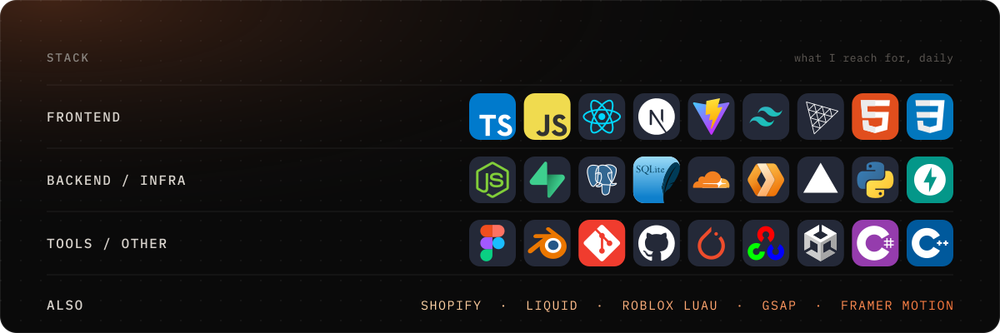

 

I build products end to end for clients: clinic and hospital management SaaS, admin panels, learning platforms, custom e-commerce with payments, Shopify themes, and fast marketing sites. Usually Next.js on the front, Supabase or Cloudflare Workers behind it, shipped on Vercel or Cloudflare.

Most of that work lives in private client repos, so the contribution count below says more than the pinned repos do.

 

 

 

  
  

